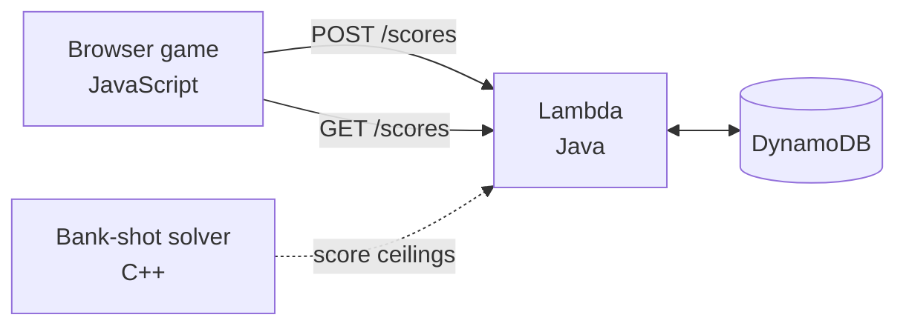

# Tanks Arena

A browser tank game where shells ricochet off walls, backed by a score service that keeps a shared leaderboard.

**Play:** https://zioo04.github.io/cpp-java-aws-project/

Clear every enemy tank in a procedurally generated maze. Shells bounce once off any wall, so the fastest shot is often the indirect one. Mines destroy wooden blocks and open new firing lines.

---

## Why three languages

Each piece of the stack does the job it is actually good at.

| Part | Language | What it does |
|---|---|---|
| Game client | JavaScript (Canvas) | Runs in the browser, which only executes JS. Handles rendering, input, and physics. |
| Bank-shot solver | C++ | Searches ricochet paths — mirror reflection, segment/box intersection, shortest valid route. Heavy per-frame math, so it lives in the language built for it. |
| Score service | Java (AWS Lambda) | Accepts and serves scores. Validates submissions against the solver's output instead of trusting the client. |
| Storage & hosting | AWS | Lambda runs the service, DynamoDB stores scores, a Function URL exposes the endpoint. |

The pieces connect in one line: **C++ computes the limits → Java validates against them → AWS stores the result.**



---

## Anti-cheat

The browser computes its own score, so a submitted score cannot be trusted. The service rejects anything that could not have happened:

- A score above the maximum reachable at the reported level
- A run shorter than the minimum time needed to clear that many enemies
- Names outside the allowed length and character set

The per-level ceilings come from the C++ solver, which enumerates every enemy a level can spawn and the points each is worth.

---

## Repository layout

```
index.html      Game client, deployed to GitHub Pages
engine/         C++ bank-shot solver and tests
api/            Java Lambda handler
```

---

## Status

- [x] Game client with mines, ricochet physics, and a leaderboard
- [x] Deployed to GitHub Pages
- [ ] C++ bank-shot solver
- [ ] Java score service on Lambda + DynamoDB
- [ ] Purple tanks use the solver to hit players behind cover
- [ ] Compile the solver to WebAssembly so the game runs the C++ directly

---

## Running locally

The game is a single file with no build step:

```bash
python3 -m http.server 8000
# open http://localhost:8000
```

The solver:

```bash
cd engine && cmake -B build && cmake --build build && ./build/bankshot
```

The service:

```bash
cd api && mvn package
```

---

## 한국어 요약

벽에 튕기는 포탄으로 적 탱크를 부수는 브라우저 게임입니다.

게임 화면은 브라우저에서 돌아가야 하므로 JavaScript로 만들었습니다. 반사 경로 탐색은 매 프레임 반복되는 무거운 계산이라 C++로 분리했고, 점수는 클라이언트가 계산하기 때문에 신뢰할 수 없어 Java 서비스에서 검증한 뒤 DynamoDB에 저장합니다. C++ 솔버가 레벨별 최대 획득 점수를 산출하고, Java가 그 값을 기준으로 제출된 점수를 판정합니다.

조작은 왼쪽 스틱으로 이동, 화면을 눌러 조준·발사입니다. 키보드는 WASD 이동, 스페이스 발사, E 지뢰 설치입니다.
