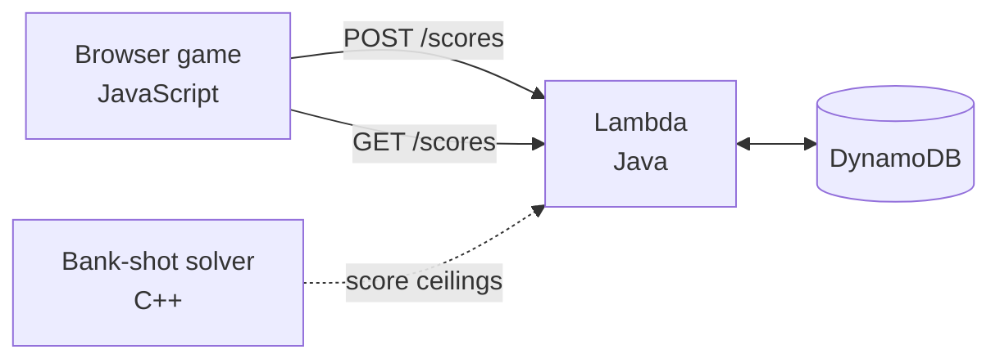

# Tanks Arena

A browser tank game where shells ricochet off walls, backed by a score service that keeps a shared leaderboard.

**Play:** https://zioo04.github.io/cpp-java-aws-project/

Clear every enemy tank in a procedurally generated maze. Shells bounce once off any wall, so the fastest shot is often the indirect one. Mines destroy wooden blocks and open new firing lines. Scores from every player land in the same leaderboard.

---

## Why three languages

Each piece of the stack does the job it is actually good at.

| Part | Language | What it does |
|---|---|---|
| Game client | JavaScript (Canvas) | Runs in the browser, which only executes JS. Handles rendering, input, and physics. |
| Bank-shot solver | C++ | Searches ricochet paths — mirror reflection, segment intersection, shortest valid route. Heavy repeated math, so it lives in the language built for it. |
| Score service | Java (AWS Lambda) | Accepts and serves scores. Validates submissions against the solver's output instead of trusting the client. |
| Storage & hosting | AWS | Lambda runs the service, DynamoDB stores scores, a Function URL exposes the endpoint. |

The pieces connect in one line: **C++ computes the limits → Java validates against them → AWS stores the result.**



---

## The bank-shot solver

A shell bounces once off a wall, so a target behind cover is still reachable. The solver mirrors the target across a wall plane: a straight line to the mirrored point crosses the wall exactly where a real shell would bounce toward the real target. Same trick as a bank shot in pool.

It tries all four walls and keeps the shortest path that actually connects, because a long detour gives the target time to drive away. Both legs of the path are traced separately — shooter to bounce point, bounce point to target — and a shot only counts if both are clear.

```
Arena  (# wall, P shooter, A/B targets)

    #.P....#...A.#
    #......#.....#
    #...B........#

  target        shot      wall     angle     path
  A             ricochet  bottom    50.7°    355.3
  B             direct    none      63.4°    111.8
```

A is behind the wall column, so the straight shot is blocked and the solver finds a ricochet off the bottom wall. B is in the open and takes the direct line.

---

## Anti-cheat

The browser computes its own score, so a submitted score cannot be trusted. The service rejects anything that could not have happened:

- A score above the maximum reachable at the reported level
- A level outside the range the game can produce
- Names outside the allowed length and character set

The per-level ceilings come from the C++ solver's model of the game, which enumerates every enemy a level can spawn and the points each is worth.

---

## Repository layout

```
index.html                 Game client, deployed to GitHub Pages
engine/bankshot.cpp        C++ solver and its tests
api/src/.../ScoreHandler   Java Lambda handler
api/pom.xml                Maven build, shaded jar for Lambda
```

---

## Status

- [x] Game client with mines, ricochet physics, and a leaderboard
- [x] Deployed to GitHub Pages
- [x] C++ bank-shot solver
- [x] Java score service on Lambda + DynamoDB
- [ ] Purple tanks use the solver to hit players behind cover
- [ ] Narrow the Lambda role from DynamoDB full access to the single table
- [ ] Compile the solver to WebAssembly so the game runs the C++ directly

---

## Notes from building it

**Duplicate CORS headers.** The leaderboard loaded over `curl` but stayed empty in every browser. The Function URL's CORS configuration and the handler code were each attaching `Access-Control-Allow-Origin`, so the response carried the header twice and browsers rejected it as ambiguous. `curl` ignores CORS entirely, which is why the endpoint looked healthy the whole time. Turning off the Function URL's CORS block and letting the handler own the headers fixed it.

**Trimming the SDK.** The AWS SDK pulls in Netty and Apache HTTP by default. Neither is needed for a handler this small, so both are excluded in favour of the JDK's own client — smaller jar, shorter cold start.

**DynamoDB reserved words.** `name` is reserved, so the attribute is stored as `playerName` and mapped back on the way out.

---

## Known issues

- Non-ASCII names can come back garbled. The handler reads the request body without pinning the charset.
- The leaderboard scans the whole table and sorts in memory. Fine at this size; a sort key on score is the right fix later.
- The first request after an idle period waits on a Lambda cold start. The game only calls the API between rounds, so it never interrupts play.

---

## Running locally

The game is a single file with no build step:

```bash
python3 -m http.server 8000
# open http://localhost:8000
```

The solver:

```bash
cd engine
g++ -std=c++17 -O2 -o bankshot bankshot.cpp && ./bankshot
```

The service:

```bash
cd api && mvn package
# target/score-api.jar uploads straight to Lambda
```

---

## 한국어 요약

벽에 튕기는 포탄으로 적 탱크를 부수는 브라우저 게임입니다. 모든 플레이어의 점수가 같은 랭킹에 쌓입니다.

게임 화면은 브라우저에서 돌아가야 하므로 JavaScript로 만들었습니다. 반사 경로 탐색은 경우의 수가 많은 반복 계산이라 C++로 분리했고, 점수는 클라이언트가 계산하기 때문에 신뢰할 수 없어 Java 서비스에서 검증한 뒤 DynamoDB에 저장합니다. C++ 솔버가 레벨별 최대 획득 점수를 산출하고, Java가 그 값을 기준으로 제출된 점수를 판정합니다.

조작은 왼쪽 스틱으로 이동, 화면을 눌러 조준·발사입니다. 키보드는 WASD 이동, 스페이스 발사, E 지뢰 설치입니다.
